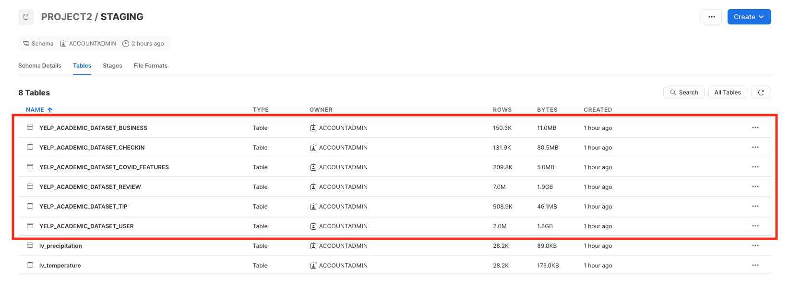
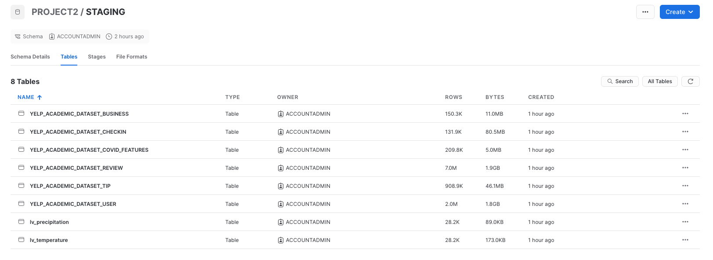
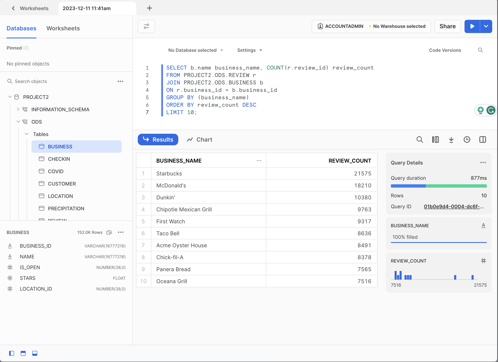

# Design Data Warehouse for Reporting and OLAP

>This repository contains projects and practice set for Udacity Designing Data Systems Course.

## Design a Data Warehouse for Reporting and OLAP (Effect of Weather on Restaurant Reviews)</a>

>In this project, I had to use actual YELP and climate datasets in order to analyze the effects the weather has on customer reviews of restaurants. The data for temperature and precipitation observations are from the Global Historical Climatology Network-Daily (GHCN-D) database.
I used the data and build a Data System on <a href="https://www.snowflake.com/en/"> Snowflake</a> to be able to infer _"How the weather effects Restaurant Reviews"_.

## Goal of the Project

>The goal is to create a Data Warehouse that can be used for reporting and OLAP. The Data Warehouse should be able to help us answer question regarding the effect of weather on restaurant reviews.

## Data Sources

### YELP

><a href="https://www.yelp.com/dataset/download">YELP</a> dataset.
>
>It contains JSON files with different contents, such as:
>
>1. Business Information (Restaurant, Cafeteria, Fast-food...)
>2. Review
>3. User
>4. Tip
>5. Check in

### Covid-19 dataset

> Covid-19 dataset from Yelp on <a href="https://www.kaggle.com/datasets/claudiadodge/yelp-academic-data-set-covid-features?select=yelp_academic_dataset_covid_features.json">Kaggle</a>

### Climate Dataset (GHCN-D)

>Climate datasets from the <a href="https://crt-climate-explorer.nemac.org/"> Global Historical Climatology Network-Daily (GHCN-D)</a>
>
>- Precipitation Data - USW00023169-LAS VEGAS MCCARRAN INTL AP-PRECIPITATION-INCH
>
>- Temperature Data - USW00023169-TEMPERATURE-DEGREEF
>
>It contains .CSV files with Temperature and Precipitation from Las Vegas, Nevada.

# Solution

## 1.Data Architecture Diagram

> 
>
>> 1. **Collect** the needed data, in our case the data came from multiple files from different sources as input.
>> 2. **Ingest** the data into **STAGE** area where no manipulation is made. The only transformation is flattening the JSON nested data.
>> 3. **Operational Data Store (ODS)** to keep every transactional data **OLTP** in a single place where it can be used for enterprise.
>> 4. **Data Warehouse (DWH)** where the data is organized in star schema and serve for **OLAP** reporting systems.
>> 5. **Analyse, Report,** and **Derive** an insight from the data, answer the business given questions.

## 2.Staging Area

>>To upload the data to the Snowflake I used the snowsql CLI. <a href="https://github.com/alsubaie-os/Udacity-Data-Architect-Nanodegree-Repo/blob/c79944fbdbf0298b1adee32f09b503935e9b0b1c/Project_2%20Design%20a%20Data%20Warehouse%20for%20Reporting%20and%20OLAP/Script/Upload_files_for_staging.sh">Here</a> is the script used to upload the files before moving to STAGE.
>
>>It is important to mention the usage of flags `auto_compress=true` and `parallel=4` for big files to allow better performance while uploading.
>
>>With the data published to the Snowflake, it is time to move to the STAGE schema.
>>
>>1. <a href="https://github.com/alsubaie-os/Udacity-Data-Architect-Nanodegree-Repo/blob/c79944fbdbf0298b1adee32f09b503935e9b0b1c/Project_2%20Design%20a%20Data%20Warehouse%20for%20Reporting%20and%20OLAP/SQL%20Queries/json_staging.sql">SQL</a> commands to move data from JSON to STAGE.
>>2. <a href="https://github.com/alsubaie-os/Udacity-Data-Architect-Nanodegree-Repo/blob/c79944fbdbf0298b1adee32f09b503935e9b0b1c/Project_2%20Design%20a%20Data%20Warehouse%20for%20Reporting%20and%20OLAP/SQL%20Queries/csv_staging.sql">SQL</a> commands to move data from CSV to STAGE.

### Yelp Data

> 

### Climate Data

>  

## 3.Operational Data Store (ODS)

### Physical ERD
>  

### Stage to ODS Query

<a href="https://github.com/alsubaie-os/Udacity-Data-Architect-Nanodegree-Repo/blob/c79944fbdbf0298b1adee32f09b503935e9b0b1c/Project_2%20Design%20a%20Data%20Warehouse%20for%20Reporting%20and%20OLAP/SQL%20Queries/staging_to_ods.sql">Queries</a> to move Stage data to ODS applying different sets of filter and creating the relationships between objects.

### SQL Query AS a Prof for ODS tables

> Join Review and Business tables to get the name of the business with the highest review count.
>
>  

### Data Size Comparison
>  

## 4.Data Warehouse (DWH)

### Star Schema

>  

### ODS to DWH Query

><a href="https://github.com/alsubaie-os/Udacity-Data-Architect-Nanodegree-Repo/blob/c79944fbdbf0298b1adee32f09b503935e9b0b1c/Project_2%20Design%20a%20Data%20Warehouse%20for%20Reporting%20and%20OLAP/SQL%20Queries/ods_to_dwh.sql">Queries</a> to create star scheam and move data from ODS to DWH applying different sets of filter and creating the relationships between objects.

### SQL Query AS a Prof for DWH tables

><a href="https://github.com/alsubaie-os/Udacity-Data-Architect-Nanodegree-Repo/blob/c79944fbdbf0298b1adee32f09b503935e9b0b1c/Project_2%20Design%20a%20Data%20Warehouse%20for%20Reporting%20and%20OLAP/SQL%20Queries/analysis_query.sql">Queries</a>
Shows a SQL query for generated report that clearly includes business name, temperature, precipitation, and ratings.
>
>  
